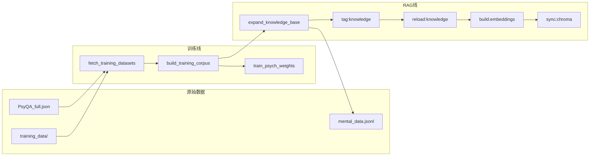

# 数据处理指南

心理港湾数据分两条线：**在线 RAG（咨询检索）** 与 **离线训练（算法权重）**。本文说明源数据、处理步骤与一键命令。

---

## 一、数据流总览



| 产出文件 | 用途 |
|----------|------|
| `server/data/mental_dataset.json` | RAG 知识库（800+ 条） |
| `vector_db/documents.json` | 向量检索文档（5000+ 条） |
| SQLite `vector_documents.embedding_json` | Ollama 语义向量 |
| Chroma `psyqa_knowledge` | 可选 HNSW 检索 |
| `training_data/unified_corpus.jsonl` | 算法训练语料 |
| `server/data/psych_model_weights.json` | 统计/ML 融合权重 |

---

## 二、一键处理（推荐）

在仓库根目录 `PsyQA1/`：

```bash
# 全量：训练 + RAG（国内源，失败不阻断）
python scripts/process_data_pipeline.py

# 或双击
数据处理.bat

# 仅 RAG（答辩前更新知识库）
python scripts/process_data_pipeline.py --mode rag --download

# 仅训练（离线）
python scripts/process_data_pipeline.py --mode training --offline
```

在 `PsyQA/` 目录：

```bash
npm run pipeline:data          # full
npm run pipeline:data:rag      # 仅 RAG
npm run pipeline:data:training # 仅训练
```

处理报告：`PsyQA/server/data/data_pipeline_report.json`  
日志：`logs/data_pipeline/`

---

## 三、分步命令（手动）

### 3.1 RAG 线（在线咨询）

| 步骤 | 命令 | 说明 |
|------|------|------|
| 1 合并扩充 | `npm run expand:knowledge` | 写入 mental_dataset + vector_db |
| 2 打标签 | `npm run tag:knowledge` | 问题/情绪标签 |
| 3 热重载 | `npm run reload:knowledge` | 后端无需重启即可读新库 |
| 4 语义嵌入 | `npm run build:embeddings` | 需 `ollama pull nomic-embed-text` |
| 5 Chroma | `npm run sync:chroma` | 需 `PSYQA_CHROMA_ENABLED=1` + Docker |

### 3.2 训练线（算法权重）

| 步骤 | 命令 |
|------|------|
| 拉取/扫描 | `npm run fetch:training-data` 或 `:offline` |
| 归一化 | `npm run build:training-corpus` |
| 训练权重 | `npm run train:psych-weights` |

数据集清单见 [04_算法训练数据集清单.md](./04_算法训练数据集清单.md)。

### 3.3 每月自动更新

```bash
npm run update:knowledge:monthly
# 或 --force 强制重跑
```

---

## 四、环境变量

```env
# 扩充规模
KNOWLEDGE_MAX_ITEMS=800
KNOWLEDGE_MAX_VECTOR=8000
EMBED_BATCH_LIMIT=500

# 训练网络
TRAINING_LOCAL_FIRST=1
TRAINING_DOMESTIC_ONLY=1
KNOWLEDGE_MONTHLY_TIER=domestic

# Chroma（可选）
PSYQA_CHROMA_ENABLED=1
CHROMA_URL=http://localhost:8000
OLLAMA_EMBED_MODEL=nomic-embed-text
```

---

## 五、处理后验证

```bash
cd PsyQA
npm run dev

curl http://localhost:3001/health
curl http://localhost:3001/api/questions/stats   # 需 admin 登录
```

学生端发起咨询，回答应引用更新后的知识库内容。

---

## 六、相关文档

- [04_算法训练数据集清单.md](./04_算法训练数据集清单.md)
- [05_Chroma向量库.md](./05_Chroma向量库.md)
- [安装与运行.md](./安装与运行.md)
