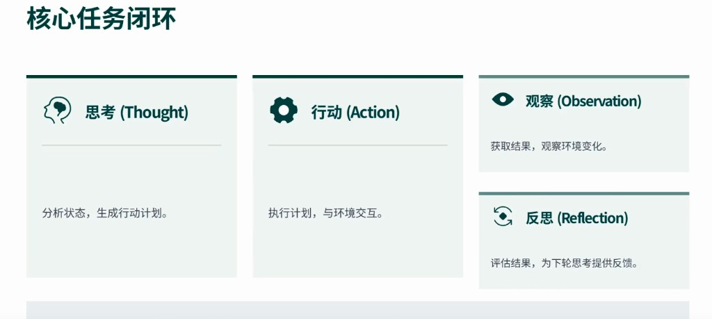

# 远程同步日志

## 2026-07-27 · ReAct 回退与 LLM 客户端修复

**仓库**：https://github.com/pengjianhao-work/psyql  
**分支**：`develop`  
**主题**：撤销加速优化，恢复完整 ReAct；修复 `zhipuClient` 路径与编译错误

### 变更摘要

- `PSYQA_AGENT_MODE=react` 恢复完整 4 步 ReAct（不再走预检索单轮捷径）
- 心理分析恢复 LLM（`tryLlm: true`），超时恢复 90s
- `server.ts` 修正 `zhipuClient` 导入至 `services/llm/zhipuClient`
- 删除旧路径 `services/zhipuClient.ts`、`services/interventionService.ts`（已迁至 `psych/`）

### 推送方式

本地 `.git` 对象库损坏时，请在本机 PowerShell 执行：

```powershell
cd PsyQA
.\scripts\push-to-github.ps1
```

### 未纳入本次推送

- `.env`（含 API Key，切勿提交）
- `psyqa.db*`、Chroma 运行时数据、大体量 JSON 数据集

---

## 2026-07-22 · 核心任务闭环

**主题**：落地示意图「思考 → 行动 → 观察 → 反思」闭环 Agent



### 变更摘要

- 新增 `coreTaskLoopAgent.ts`，步骤与答辩图一一对应
- `PSYQA_AGENT_MODE=loop`（别名 `core` / `taor`）
- Loop / ToT 默认挂载 Self-Ask 验证
- 示意图存档：`docs/assets/核心任务闭环.png`

---

## 2026-07-22 · Self-Ask 验证

**主题**：ToT 草稿后增加 Self-Ask（自问自答）质量验证

### 变更摘要

- 新增 `selfAskVerify.ts`：对回复草稿做 3 项核查（核心困扰 / 安全非诊断 / 可执行建议）
- ToT 模式默认开启；`PSYQA_SELF_ASK_VERIFY=0` 关闭，`=1` 任意模式强制开启
- 未通过则自动修订；推理面板展示 probe → answer → verdict → revise
- 默认规则核查；`PSYQA_SELF_ASK_LLM=1` 改用 LLM 核查

### 主要文件

| 路径 | 说明 |
|------|------|
| `server/src/services/llm/selfAskVerify.ts` | Self-Ask 验证实现 |
| `server/src/services/llm/counselAgent.ts` | 主推理后挂载验证 |
| `server/src/__tests__/selfAskVerify.test.ts` | 单元测试 |

---

## 2026-07-22 · develop → origin

**仓库**：https://github.com/pengjianhao-work/psyql  
**分支**：`develop`（已推送 `origin/develop`）  
**提交**：`bbb5efad` — Add ToT (Tree of Thoughts) counseling agent and sync log.  
**PR**：https://github.com/pengjianhao-work/psyql/pull/new/develop  

**主题**：接入 ToT（Tree of Thoughts）思维树推理

### 变更摘要

- 新增 `totCounselAgent`：展开多策略分支 → 评估 → 选定 → 生成回复
- `PSYQA_AGENT_MODE=tot` 可启用；支持 `PSYQA_TOT_BRANCHES`、`PSYQA_TOT_LLM_EVAL`
- 前端推理面板展示 ToT 步骤（expand / evaluate / select / respond）
- 文档与 `.env*.example` 同步更新

### 主要文件

| 路径 | 说明 |
|------|------|
| `server/src/services/llm/totCounselAgent.ts` | ToT 推理实现 |
| `server/src/services/llm/agentPolicy.ts` | 模式策略含 `tot` |
| `server/src/services/llm/counselAgent.ts` | 调度入口 |
| `server/src/__tests__/totCounselAgent.test.ts` | 单元测试 |
| `client/src/components/ChatMessage.tsx` | ToT 步骤 UI |

### 未纳入本次推送

- 本地 SQLite（`psyqa.db*`）与运行时记忆元数据
- 大体量数据集删除（若需清理请单独提交）

### 启用

```bash
PSYQA_AGENT_MODE=tot
```
